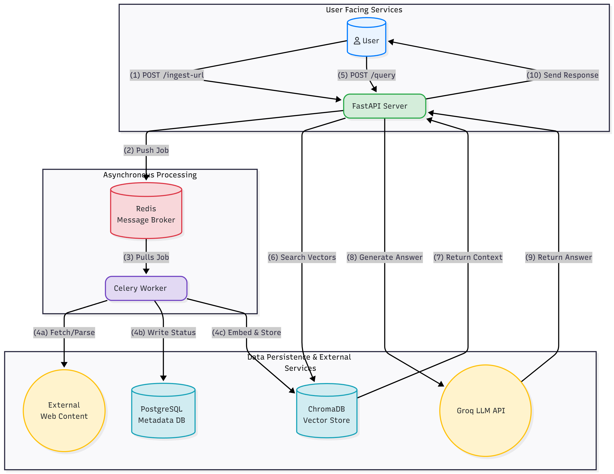

# Scalable Web-Aware RAG Engine

This project is a scalable, asynchronous, and memory-driven system designed to ingest web content and answer questions based on the ingested knowledge. It demonstrates a robust microservices architecture using a message queue for background processing, a vector database for semantic search, and a metadata store for job tracking.

## System Architecture



The system is composed of five containerized services orchestrated by Docker Compose, ensuring a clean separation of concerns and a reproducible environment.

### Key Workflows

1. **Asynchronous Ingestion:** A POST request to `/ingest-url` immediately creates a job record in PostgreSQL, pushes a task to Redis, and returns a 202 Accepted response. The Celery worker picks up the task, fetches and parses the web content, chunks it, generates embeddings, and stores them in ChromaDB, updating the job status in PostgreSQL upon completion or failure.

2. **Querying:** A POST request to `/query` embeds the user's question, performs a semantic search against ChromaDB to retrieve relevant context, and then passes this context to the Groq LLM to generate a grounded, fact-based answer.

## Technology Stack & Justification

| **Component** | **Technology** | **Justification** |
|---------------|----------------|-------------------|
| **API Server** | **FastAPI** | Chosen for its high performance, native async support, and automatic data validation with Pydantic, enabling a highly responsive API as required. |
| **Task Queue** | **Celery** with **Redis** Broker | The industry standard for asynchronous task processing in Python. Decouples heavy tasks from the API, ensuring immediate user feedback. |
| **Metadata Store** | **PostgreSQL** | A robust, scalable, and reliable relational database perfect for storing structured job metadata (status, URL, timestamps). |
| **Vector Database** | **ChromaDB** | A modern, open-source vector database that simplifies the storage and retrieval of embeddings for efficient semantic search. |
| **LLM** | **Groq API** (llama3-8b-instant) | Provides extremely fast inference speeds, which is critical for a responsive and scalable query API. |
| **Orchestration** | **Docker & Docker Compose** | Ensures a consistent, reproducible, and isolated development and deployment environment. Simplifies the management of all microservices. |
| **Embedding Model** | all-MiniLM-L6-v2 | A lightweight but powerful sentence-transformer model that runs locally, providing fast and effective embeddings without external API calls. |

## Database Schema

### PostgreSQL Metadata Store

The `ingestion_jobs` table tracks the status of each URL submission. The table is created automatically on API startup.

```sql
CREATE TABLE ingestion_jobs (
    id UUID PRIMARY KEY,
    url VARCHAR NOT NULL UNIQUE,
    status VARCHAR NOT NULL DEFAULT 'PENDING',
    created_at TIMESTAMP WITH TIME ZONE DEFAULT now(),
    updated_at TIMESTAMP WITH TIME ZONE DEFAULT now()
);
```

### ChromaDB Vector Store

The vector store contains a single collection defined by the environment variable `CHROMA_COLLECTION_NAME` (default: `web_content`). Each document stored in this collection has the following structure:

- **Embedding Vector:** Generated by the all-MiniLM-L6-v2 model (384 dimensions).
- **Document:** The raw text chunk (max 1000 characters).
- **Metadata:** `{"source_url": "https://example.com"}` - Used for answer attribution.

## API Documentation

The API is fully documented using OpenAPI, and the interactive Swagger UI is available once the system is running at:

**http://localhost:8000/docs**

### Endpoints

#### 1. Ingest a URL

- **Endpoint:** `POST /ingest-url`
- **Description:** Submits a URL for asynchronous processing.
- **Request Body:**
```json
{
    "url": "https://en.wikipedia.org/wiki/2019_Cricket_World_Cup"
}
```
```json
{
    "url": "https://en.wikipedia.org/wiki/2023_Cricket_World_Cup"
}
```

- **Success Response (202 Accepted):**
```json
{
    "job_id": "a1b2c3d4-e5f6-a7b8-c9d0-e1f2a3b4c5d6",
    "status": "PENDING",
    "message": "URL has been accepted and is pending processing."
}
```

- **curl Example:**
```bash
curl -X 'POST' \
  'http://localhost:8000/ingest-url' \
  -H 'accept: application/json' \
  -H 'Content-Type: application/json' \
  -d '{
  "url": "https://en.wikipedia.org/wiki/Artificial_intelligence"
}'
```

#### 2. Query the Knowledge Base

- **Endpoint:** `POST /query`
- **Description:** Asks a question against the ingested content.
- **Request Body:**
```json
{
  "query": "In which world cup Kane williamson was player of the tournament?"
}
```

```json
{
    "query": "In which world cup did India reach finals?"
}
```

- **Success Response (200 OK):**
```json
{
    "answer": "Based on the provided context, some applications of large language models include being used as a base for chatbots such as ChatGPT, and in the development of foundation models.",
    "sources": [
        "https://en.wikipedia.org/wiki/Large_language_model"
    ]
}
```

- **curl Example:**
```bash
curl -X 'POST' \
  'http://localhost:8000/query' \
  -H 'accept: application/json' \
  -H 'Content-Type: application/json' \
  -d '{
  "query": "What are some applications of LLMs?"
}'
```

## Setup and Run Instructions

1. **Prerequisites:**
   - [Docker](https://www.docker.com/get-started/) installed and running.
   - git installed.

2. **Clone the repository:**
```bash
git clone <your-repo-url>
cd project-rag-engine
```

3. **Configure Environment Variables:**
   - Copy the example environment file:
   ```bash
   # For PowerShell
   Copy-Item .env.example .env
   
   # For Bash (Linux/macOS)
   cp .env.example .env
   ```
   
   - Edit the `.env` file and add your **GROQ_API_KEY**.

4. **Build and Run the System:**
   - Run the following command from the project root. This will build the Docker images and start all services in the background. The first build may take several minutes to download all dependencies. Subsequent builds will be much faster due to caching.
   ```bash
   docker-compose up --build -d
   ```

5. **Access the Service:**
   - The API will be available at http://localhost:8000.
   - The interactive API documentation is at http://localhost:8000/docs.

6. **Shut Down the System:**
   - To stop all running containers, run:
   ```bash
   docker-compose down
   ```

## Demo Video

<<<<<<< HEAD

=======
*[A link to your 5-10 minute demo video will go here. I recommend uploading it to a service like Loom or as an Unlisted YouTube video.]*
>>>>>>> a1e6808bd348114b3728983655f6b495cd4463de
